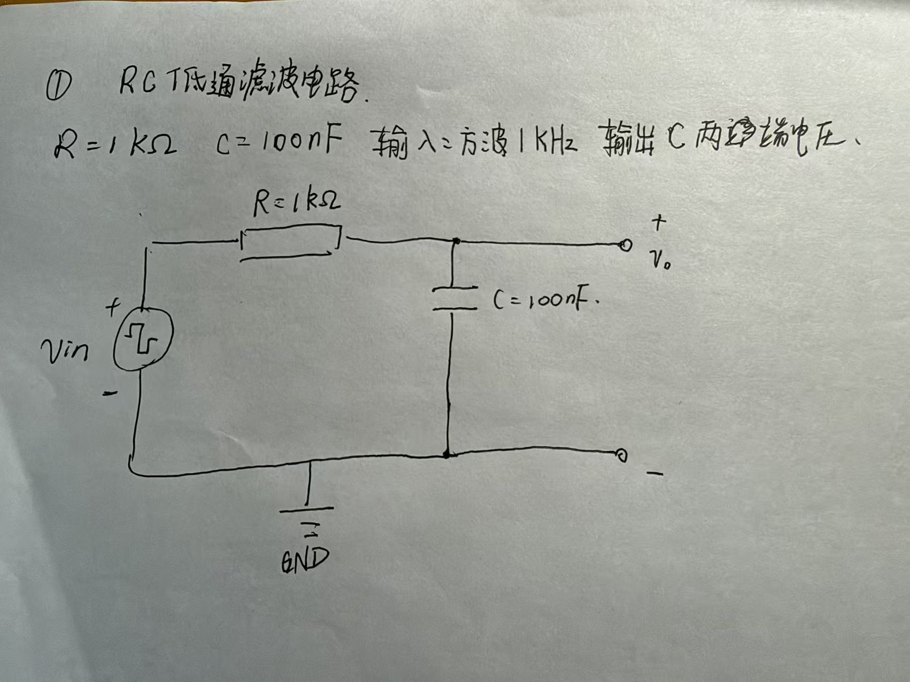
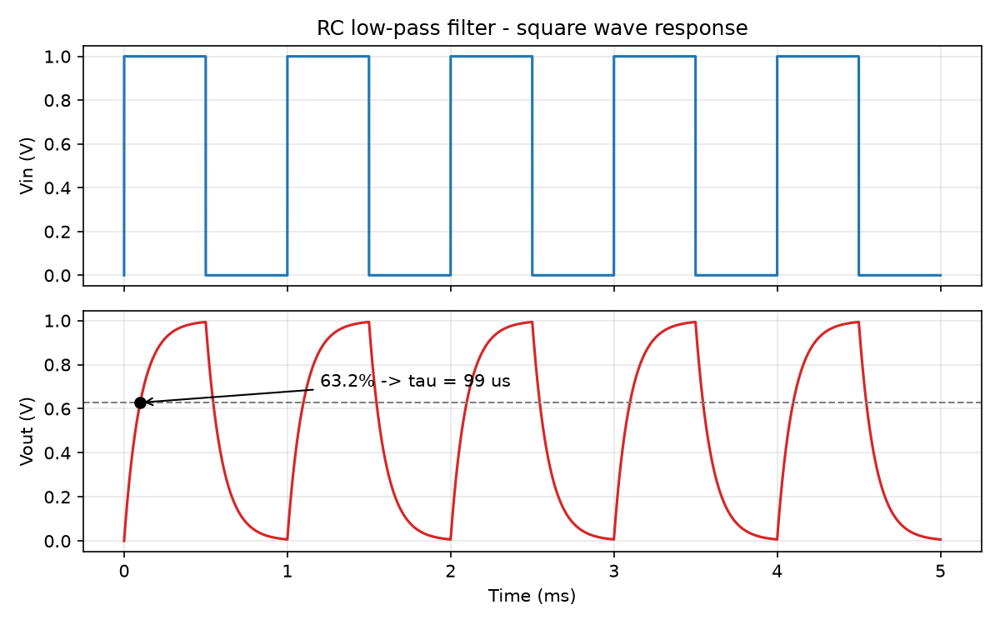
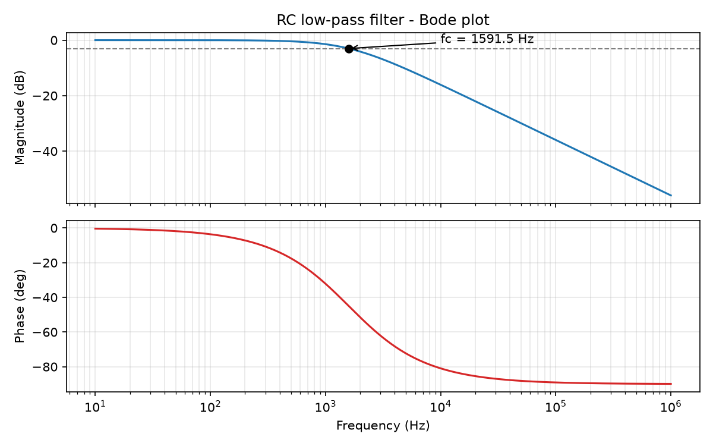
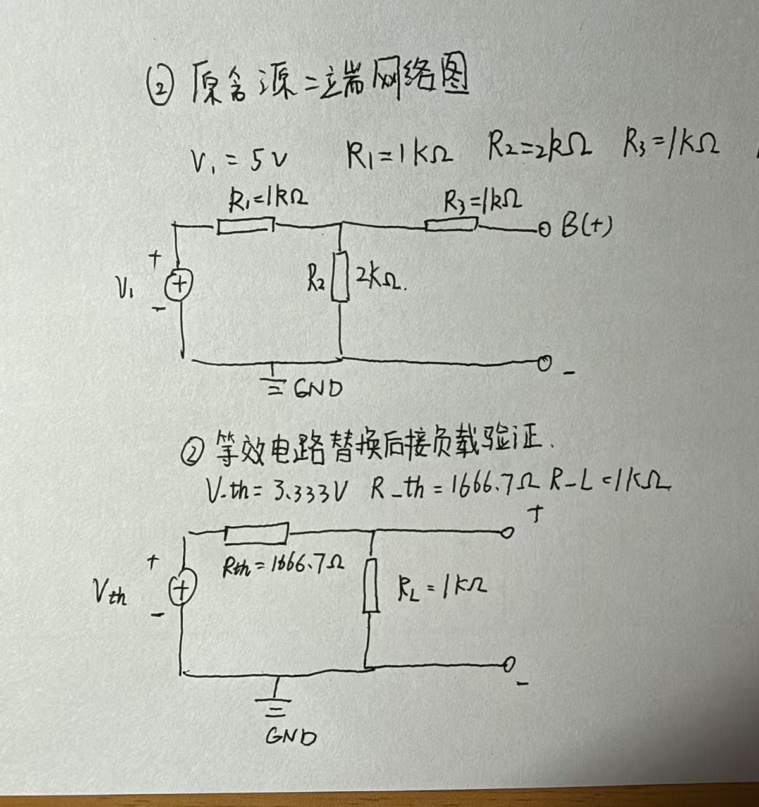
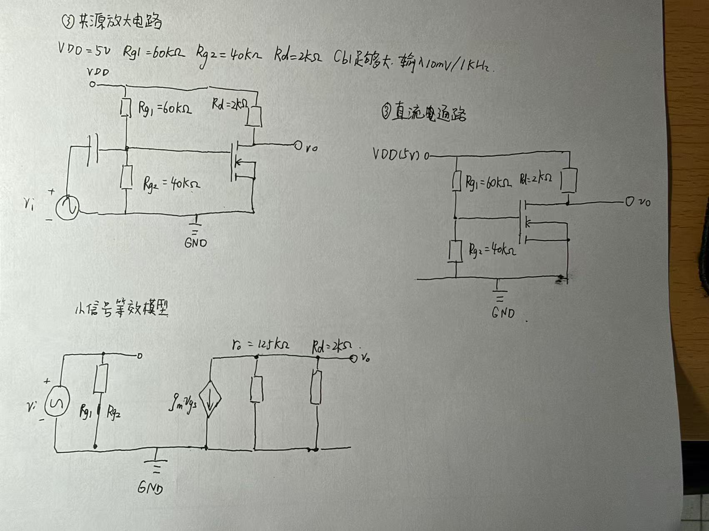
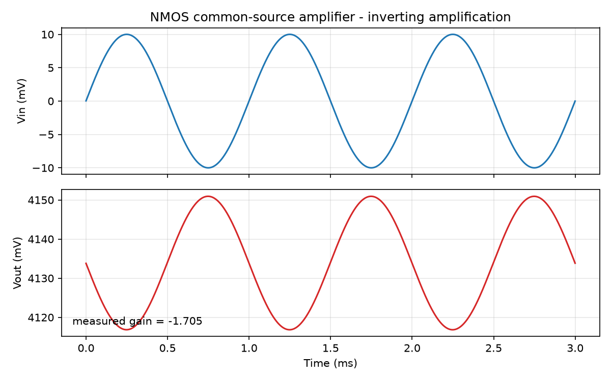

# 进阶挑战任务一：使用 PySpice 完成三个电路

## 环境与运行方法

- 系统：WSL2 + Ubuntu 26.04，Python 3.14
- 依赖：PySpice 1.5、ngspice 45.2、numpy、matplotlib

在 ~/circuits 目录下运行：

    python rc_filter.py

## 目录结构

- rc_filter.py —— 电路① RC 低通滤波
- thevenin.py —— 电路② 戴维南定理验证
- mos_cs_amp.py —— 电路③ NMOS 共源放大
- figures/ —— 所有图片（电路图 + 仿真波形）
- README.md —— 本文件

---

## ① RC 低通滤波电路

### 1. 电路图

元件参数自定：R = 1 kΩ，C = 100 nF。输入为 1 kHz 方波（0 ~ 1 V），输出取电容两端电压。

### 2. 理论值计算

**（1）传递函数**

电容的阻抗 Z_C = 1/(jωC)，R 与 C 串联构成分压，输出取电容两端电压：

    V_o = V_i · (1/jωC) / (R + 1/jωC)

分子分母同乘 jωC 得：

    H(jω) = V_o / V_i = 1 / (1 + jωRC)

**（2）幅频与相频特性**

    |H| = 1 / √(1 + (ωRC)²)
    φ   = −arctan(ωRC)

**（3）截止频率的定义与推导**

截止频率定义为幅度降到最大值的 1/√2（即 −3 dB）处的频率。令 ωRC = 1，得：

    f_c = 1 / (2πRC)

**（4）代入数值**

    τ   = RC = 1×10³ Ω × 100×10⁻⁹ F = 1×10⁻⁴ s = 100.0 µs
    f_c = 1 / (2π × 1×10⁻⁴ s) = 1591.5 Hz

**（5）方波输入下的理论响应**

充电：v_o(t) = V(1 − e^(−t/τ))　　放电：v_o(t) = V₀·e^(−t/τ)

    t = τ   → 63.2%
    t = 3τ  → 95.0%
    t = 5τ  → 99.3%

本题方波半周期为 0.5 ms = 5τ，因此每个半周期结束时输出已接近稳态（约 0.993 V 与 0.0067 V），波形呈"快速上升后拉平"的形状。

### 3. 仿真设置

- 瞬态分析：PULSE 源 0 V → 1 V，频率 1 kHz，上升/下降时间 1 ns；步长 1 µs，总时长 5 ms
- 交流分析：直流 0 V / 交流 1 V 的源，扫描 10 Hz ~ 1 MHz，每十倍频 100 点（共 501 点）

### 4. 仿真结果

上图为输入方波，下图为输出（红色），圆点标注输出达到 63.2% 的时刻，据此读出 τ。

上图为幅频特性（dB），下图为相频特性，圆点标注 −3 dB 对应的截止频率。

### 5. 理论值 vs 仿真值

| 项目 | 理论值 | 仿真值 | 相对误差 |
|---|---|---|---|
| 时间常数 τ | 100.0 µs | 99.0 µs | 1.0% |
| 截止频率 f_c | 1591.5 Hz | 1591.5 Hz | < 0.1% |

### 6. 误差分析

- **τ 相差 1 µs（约 1%）**：瞬态仿真的时间步长为 1 µs，判断"输出达到 63.2%"时的读数只能落在离散的采样点上，量化误差约为 ±1 µs。把步长减小到 0.1 µs 可以相应减小这一误差。
- **f_c 几乎完全吻合**：理想 RC 电路的 −3 dB 频率精确等于 1/(2πRC)，且对仿真幅频曲线做了线性插值求交点，因此与理论值一致。
- **方波边沿的影响**：方波源的上升/下降时间设为 1 ns 而非理想阶跃，是为了数值稳定；该时间远小于 τ，对 τ 的读数影响可以忽略。

---

## ② 戴维南定理验证

### 1. 电路图

网络参数自定：V1 = 5 V，R1 = 1 kΩ，R2 = 2 kΩ，R3 = 1 kΩ。端口取节点 B（+）与地（−）。

### 2. 理论值计算

**（1）开路电压 V_oc**

端口断开时 R3 上没有电流，B 点电位等于 A 点电位，电路退化为 R1、R2 分压：

    V_oc = V_A = V1 × R2/(R1 + R2) = 5 × 2/(1 + 2) = 3.333 V

**（2）短路电流 I_sc**

端口短路到地后，从节点 A 往下看，下臂为 R2 与 R3 并联：

    R2 ∥ R3 = (2 × 1)/(2 + 1) = 0.667 kΩ
    V_A = V1 × 0.667/(R1 + 0.667) = 5 × 0.667/1.667 = 2.0 V
    I_sc = V_A / R3 = 2.0 V / 1 kΩ = 2.0 mA

**（3）戴维南等效电阻**

    R_th = V_oc / I_sc = 3.333 V / 2.0 mA = 1666.7 Ω

独立验证（将电源短路，从端口往左看）：

    R_th = R3 + (R1 ∥ R2) = 1000 + 666.7 = 1666.7 Ω

两种方法结果一致，说明手算无误。

### 3. 仿真设置

- 开路：端口接 1 GΩ 电阻近似"断开"（节点悬空会使仿真器报错）
- 短路：端口接 0.1 Ω 电阻近似"短路"（理想短路端电压为 0，受求解精度限制反而测不准）
- 等效验证：用 V_th = 3.333 V 串 R_th = 1666.7 Ω 替代原网络，分别接 R_L = 1 kΩ 和 2 kΩ

### 4. 理论值 vs 仿真值

| 项目 | 理论值 | 仿真值 | 相对误差 |
|---|---|---|---|
| 开路电压 V_oc | 3.333 V | 3.3333 V | < 0.1% |
| 短路电流 I_sc | 2.000 mA | 1.9999 mA | 0.005% |
| 等效电阻 R_th | 1666.7 Ω | 1666.8 Ω | < 0.1% |

### 5. 等效电路替换后的负载验证

| 负载 R_L | 原电路 V_L | 原电路 I_L | 等效电路 V_L | 等效电路 I_L | 是否一致 |
|---|---|---|---|---|---|
| 1 kΩ | 1.2500 V | 1.2500 mA | 1.2500 V | 1.2500 mA | 一致 |
| 2 kΩ | 1.8182 V | 0.9091 mA | 1.8182 V | 0.9091 mA | 一致 |

### 6. 误差分析

- **I_sc 比理论值小 0.005%**：因为用 0.1 Ω 代替理想短路，该电阻自身会分走 0.1/1666.7 ≈ 0.006% 的电压，属于可忽略的系统偏差。
- **V_oc 的微小差异**：用 1 GΩ 近似开路，引入的相对误差约为 1666.7/1×10⁹ ≈ 1.7×10⁻⁶。
- **结论**：在两组不同负载下，原网络与等效电路给出的端口电压、电流完全一致，验证了戴维南定理"对外等效"的结论。

---

## ③ NMOS 共源放大电路

### 1. 电路图

题目给定：VDD = 5 V，Rg1 = 60 kΩ，Rg2 = 40 kΩ，Rd = 2 kΩ，Cb1 视为足够大；NMOS 参数 K = 0.8 mA/V²，V_th = 1 V，λ = 0.02 /V；输入 Vi = 10 mV / 1 kHz 正弦。

### 2. 理论值计算

**（1）静态工作点**

Cb1 隔直、栅极电流为 0，故栅极电位由 Rg1、Rg2 分压决定：

    V_G = VDD × Rg2/(Rg1 + Rg2) = 5 × 40/(60 + 40) = 2.0 V

源极接地（V_S = 0），所以：

    V_GS = V_G − V_S = 2.0 V
    V_ov = V_GS − V_th = 1.0 V > 0  →  管子导通

先假设工作在饱和区，联立两个方程：

    I_D  = ½·K·V_ov²·(1 + λ·V_DS)
    V_DS = VDD − I_D·Rd

代入数值（I_D 以 mA 计，Rd = 2 kΩ）：

    I_D  = 0.4 × (1 + 0.02 × (5 − 2·I_D)) = 0.44 − 0.016·I_D
    I_D  = 0.4331 mA
    V_DS = 5 − 2 × 0.4331 = 4.134 V

饱和区判据 V_DS > V_ov：4.134 V > 1.0 V，假设成立，**工作在饱和区**。

**（2）小信号参数**

    gm = K·V_ov·(1 + λ·V_DS) = 0.8 × 1 × 1.0827 = 0.866 mA/V
    ro = (1 + λ·V_DS)/(λ·I_D) ≈ 125 kΩ

**（3）电压增益**

    Rd ∥ ro = 2 kΩ ∥ 125 kΩ = 1.9685 kΩ
    Av = −gm·(Rd ∥ ro) = −1.705

负号表示输出与输入反相。输入 10 mV 时输出幅度约 17.05 mV（峰峰值 34.1 mV）。

### 3. 仿真设置

SPICE 的 level-1 MOS 模型使用参数 KP，且 I_D = ½·KP·(W/L)·V_ov²；题目给定的是 I_D = ½·K·V_ov²，两式相等可得 KP·(W/L) = K。取宽长比 W/L = 1，则 **KP = K = 0.8 mA/V²**。

- 静态工作点：OP 分析
- 瞬态分析：输入 10 mV / 1 kHz 正弦，步长 2 µs，总时长 5 ms
- 交流分析：10 Hz ~ 1 MHz 扫描，读取 1 kHz 处的增益与相位

另外，SPICE 先用直流工作点求解，再以此为瞬态初始条件，因此耦合电容 Cb1 一开始就已充电到稳态，不需要额外等待建立过程。

### 4. 仿真结果

上图为输入、下图为输出，可见输出与输入反相，实测增益 −1.705。

### 5. 理论值 vs 仿真值

| 项目 | 理论值 | 仿真值 | 相对误差 |
|---|---|---|---|
| V_GS | 2.0000 V | 2.0000 V | ≈ 0 |
| I_D | 0.4331 mA | 0.4331 mA | 0.000% |
| V_DS | 4.1339 V | 4.1339 V | 0.000% |
| 饱和区判断 | V_DS = 4.134 V > V_ov = 1.0 V，饱和 | 结果一致 | — |
| gm | 0.8661 mA/V | 0.8662 mA/V（由实测增益反推） | 0.01% |
| 电压增益 Av | −1.7050 | −1.7052（瞬态）；1.7050、相位 180°（交流） | 0.01% |

### 6. 误差分析

- **静态工作点完全吻合**：I_D、V_DS 的相对误差为 0.000%。原因是手算时完整保留了 λ 项，与 SPICE level-1 模型的公式完全一致。
- **增益误差 0.01%**：瞬态实测增益来自峰峰值读数，受采样点与管子的轻微非线性影响；交流分析给出的 |Av| = 1.7050、相位 180°，与小信号理论值完全一致。
- **相位为 −179.6°（接近 −180°）**：交流分析的频率扫描点以及输入耦合电容 Cb1 引入的低频相移（输入高通截止频率约 6.6 Hz）导致极小偏差，可以忽略。
- **若采用教材简化式忽略 λ 对 gm 的影响**：gm = 0.8 mA/V，Av ≈ −1.6，与仿真相差约 6%。这说明手算的简化程度会直接影响结果，而含 λ 的完整计算与仿真吻合得更好。

## AI 使用说明与踩坑记录

### 哪些内容由 AI 生成、哪些由我完成

- AI 生成：三个脚本的代码框架（电路搭建、仿真调用、绘图与数据输出）。
- 我自己完成：三张电路图全部手绘。
- 在 AI 帮助下完成：全部理论推导与人手计算（τ 与截止频率、V_oc / I_sc / R_th、V_GS / I_D / V_DS、gm、ro、Av）、每个对比表的数值核对与误差分析、SPICE 模型参数的换算与纠错——由我提出需求、逐项核对，并把结果与仿真结果对照，发现不一致时再一起排查。

### 关键提示词与迭代过程

1. 第一轮提示词要点：先给出三个电路的理论公式和手算过程，再写 PySpice 仿真代码，最后自动输出「理论值 vs 仿真值」的对比数据。
   结果：三个脚本能一键跑出波形图与对比数据，直接填入本 README。

2. 第二轮迭代：仿真电流与手算差一倍。
   现象：NMOS 电路仿真 I_D = 0.8527 mA，手算 0.4331 mA。
   排查：把两边的电流公式并排写出——SPICE 的 level-1 模型是 I_D = ½·KP·(W/L)·V_ov²，题目给的是 I_D = ½·K·V_ov²，对应项相等应为 KP·(W/L) = K；取 W/L = 1 时 KP = K = 0.8 mA/V²，而不是 2K。
   结果：改正后仿真 I_D = 0.4331 mA，静态工作点与手算误差 0.000%。

### 踩过的坑

- apt 镜像源返回 403，换用阿里云镜像后恢复。
- PySpice 找不到 ngspice 的动态库（系统只提供 libngspice.so.0），建立软链接解决。
- PySpice 的 MOSFET 元件不识别大写 W/L，必须用小写 w/l。
- 用 1 GΩ / 0.1 Ω 代替理想开路与短路，避免悬空节点报错和浮点精度问题。
